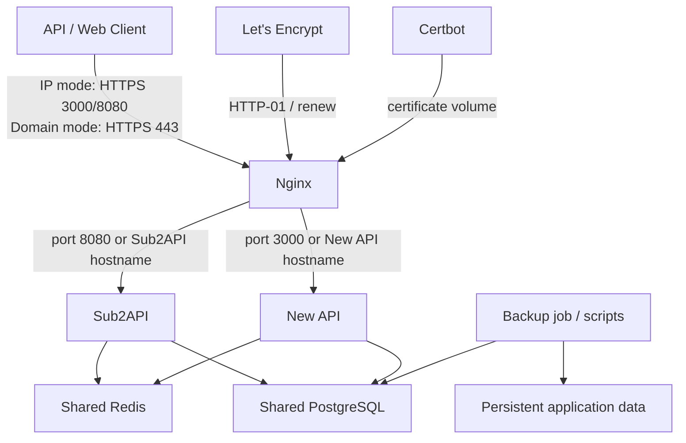

# AI API Relay Web 部署倉庫技術產品需求文件（PRD）

| 欄位 | 內容 |
|---|---|
| 文件版本 | v0.1 Draft |
| 日期 | 2026-06-25 |
| 目標平台 | Hetzner VPS，4 GB RAM，Linux x86_64 |
| 部署方式 | Docker Engine + Docker Compose |
| 核心服務 | Sub2API、New API、Nginx、Certbot、PostgreSQL、Redis |
| 主要讀者 | 開發者、系統管理員、維運人員 |

## 1. 背景

建立一個可公開放置於 GitHub 的部署倉庫，讓使用者能在單台 4 GB RAM Hetzner VPS 上，以 Docker Compose 部署兩套 AI API relay 管理服務：

- Sub2API
- New API

系統須提供 HTTPS、反向代理、持久化儲存、健康檢查、服務啟動順序、備份與容易修改的設定檔。除首次填寫環境變數及設定 DNS 外，部署流程應盡量自動化。

本專案是「部署與維運倉庫」，不修改 Sub2API 或 New API 的上游應用程式原始碼。

## 2. 產品目標

### 2.1 主要目標

1. 一條指令啟動整個服務堆疊。
2. 在 4 GB RAM 主機上穩定運行，避免不必要的重複資料庫與快取服務。
3. 初期以 VPS IP 提供 Sub2API 與 New API，取得網域後可平滑切換至不同子網域及 HTTPS。
4. 自動申請及續期 Let's Encrypt TLS 憑證。
5. 每個核心容器均具備有效的健康檢查。
6. 所有常用設定集中於容易理解及修改的設定檔。
7. 應用、資料庫及快取均不直接暴露至公網。
8. 提供可驗證及可還原的備份流程。

### 2.2 成功指標

- 新 VPS 在完成 DNS 指向及 `.env` 設定後，30 分鐘內可完成部署。
- `docker compose ps` 顯示所有核心服務為 `running` 或 `healthy`。
- 重新啟動 VPS 後，服務可自動恢復，不需人工介入。
- HTTPS 憑證可自動續期，且續期後 Nginx 自動載入新憑證。
- 在正常閒置狀態下，整個堆疊的記憶體使用量目標不高於 2.5 GB。
- 至少保留約 1 GB 記憶體供 Linux、Docker、尖峰流量及維護操作使用。
- 備份可在乾淨環境中還原 PostgreSQL 與應用持久化資料。

## 3. 非目標

本期不包含：

- Kubernetes 或 Docker Swarm。
- 多 VPS、高可用、跨區域容錯或自動水平擴展。
- 修改 Sub2API 或 New API 的業務功能。
- 自建郵件伺服器。
- Grafana、Prometheus、Loki、ELK 等完整監控平台。
- Cloudflare Tunnel、外部負載平衡器或 CDN 的強制整合。
- 自動購買網域或自動修改 DNS。
- 在同一主機運行 ClickHouse、獨立 MySQL 或第二套 PostgreSQL。

## 4. 使用者與主要情境

### 4.1 系統擁有者

需要以最低維運成本部署、更新、備份及排查整個服務。

### 4.2 API 使用者

透過 HTTPS API endpoint 使用由 Sub2API 或 New API 管理的模型渠道。

### 4.3 管理員

透過兩套 Web 管理介面建立使用者、渠道、Token、配額及查看使用紀錄。

## 5. 前提與預設決策

以下為 v0.1 採用的預設方案：

- 作業系統：Ubuntu 24.04 LTS 或 Debian 12。
- CPU 架構：`linux/amd64`。
- 部署分為兩種模式：
  - `ip`：初期共享測試，以 VPS IP 加不同 port 存取。
  - `domain`：日後正式公開，以兩個子網域及 HTTPS 存取。
- `ip` 模式入口：
  - Sub2API：`https://VPS_IP:8080`
  - New API：`https://VPS_IP:3000`
- `domain` 模式入口：
  - `https://sub2api.example.com`
  - `https://newapi.example.com`
- `ip` 模式由 Nginx 公開 TCP 80、3000、8080；`domain` 模式只公開 TCP 80、443。
- Sub2API 與 New API 共用一個 PostgreSQL 容器，但使用不同 database 與帳號。
- 兩個應用共用一個 Redis 容器，但使用不同 Redis DB index。
- Nginx 在兩種模式均負責反向代理、串流回應及基本安全標頭；在 `domain` 模式額外負責 TLS termination。
- Certbot 在兩種模式均啟用，並使用 HTTP-01 challenge；IP 模式使用 short-lived IP certificate。
- 所有上游映像版本由 `.env` 鎖定，不直接硬編碼為 `latest`。
- 日誌預設使用 Docker `json-file` rotation，不部署額外日誌平台。
- 備份只需保存在 VPS 本機；首版不整合 Hetzner Storage Box 或 S3。

## 6. 系統架構



### 6.1 服務清單

| 服務 | 用途 | 公開端口 | 持久化 | 必須有健康檢查 |
|---|---|---:|---|---|
| `nginx` | HTTP/HTTPS 與反向代理 | IP：80、3000、8080；Domain：80、443 | 設定、憑證、challenge | 是 |
| `certbot` | IP 或 Domain 憑證申請與續期 | 無 | 憑證、challenge | 以續期任務及憑證有效期驗證 |
| `sub2api` | AI API relay 服務 | 無 | `/app/data` | 是 |
| `new-api` | AI API relay 服務 | 無 | `/data`、logs | 是 |
| `postgres` | 共用關聯式資料庫 | 無 | PostgreSQL data | 是 |
| `redis` | 共用快取與狀態服務 | 無 | Redis data | 是 |

## 7. 功能需求

### FR-01：單一 Docker Compose 與統一操作介面

- 根目錄必須包含 `compose.yaml`。
- Docker Compose 是唯一的底層編排工具，不可要求使用者逐一執行 `docker run`。
- 日常建議使用 `Makefile` 作為穩定且容易記憶的操作介面：

  ```bash
  make init       # 首次初始化
  make up         # 啟動或套用設定
  make stop       # 暫停服務但保留容器
  make start      # 啟動已暫停的容器
  make restart    # 重新啟動
  make down       # 停止並移除容器，保留資料
  make status     # 查看狀態
  make health     # 完整健康檢查
  make logs       # 查看 logs
  make update     # 備份、拉取指定版本及重建
  make backup     # 建立本機備份
  ```

- `make` target 最終必須呼叫 `docker compose` 或 `scripts/*.sh`，不得建立第二套部署狀態。
- 使用者仍可直接執行 `docker compose up -d`；這是底層等價命令及故障排查途徑。
- `scripts/bootstrap.sh` 負責首次設定、secret 生成及按部署模式配置 Nginx/TLS。
- Compose 專案名稱應可透過 `COMPOSE_PROJECT_NAME` 設定。

### FR-02：Sub2API

- 使用官方發布的 `weishaw/sub2api` 映像。
- 映像 tag 由 `SUB2API_IMAGE_TAG` 設定。
- 容器內監聽 `8080`，不可直接 publish 到公網。
- 必須設定：
  - `AUTO_SETUP=true`
  - PostgreSQL 連線資訊
  - Redis 連線資訊
  - 固定的 `JWT_SECRET`
  - 固定的 `TOTP_ENCRYPTION_KEY`
  - 管理員 email 與強密碼
  - `TZ`
- 健康檢查使用應用的 `/health` endpoint。
- 必須等 PostgreSQL 與 Redis 為 healthy 後才啟動。
- `/app/data` 必須持久化。

### FR-03：New API

- 使用官方發布的 `calciumion/new-api` 映像。
- 映像 tag 由 `NEW_API_IMAGE_TAG` 設定。
- 容器內監聽 `3000`，不可直接 publish 到公網。
- 使用 PostgreSQL `SQL_DSN`，不得另行啟動 MySQL。
- 使用 Redis `REDIS_CONN_STRING`。
- 必須設定固定且隨機生成的 `SESSION_SECRET`。
- 必須設定 `NODE_NAME`、`TZ` 及錯誤日誌開關。
- `/data` 與應用 log 目錄必須持久化。
- 健康檢查使用 `/api/status`，並驗證回應包含成功狀態。
- 必須等 PostgreSQL 與 Redis為 healthy 後才啟動。

### FR-04：共用 PostgreSQL

- 使用固定 major/minor tag 的 Alpine PostgreSQL 映像；建議基線為 PostgreSQL 16。
- 初始化時建立：
  - `sub2api` database 與專用帳號。
  - `newapi` database 與專用帳號。
- 兩個應用不得共用同一資料庫帳號。
- 初始化 SQL 或 shell 檔案置於 `postgres/init/`。
- 初始化腳本必須具備 idempotent 行為，或清楚說明只在空 data directory 首次執行。
- PostgreSQL 不得 publish 主機端口。
- 健康檢查使用 `pg_isready`。
- 針對 4 GB VPS 的建議初始設定：
  - `max_connections`: 100
  - `shared_buffers`: 256 MB
  - `effective_cache_size`: 1 GB
  - `maintenance_work_mem`: 64 MB
  - `work_mem`: 4 MB
- Sub2API 初始連線池上限建議為 20，idle connections 建議為 5。
- New API 的連線設定須避免無限制增加連線。

### FR-05：共用 Redis

- 使用固定版本的 Alpine Redis 映像；建議基線為 Redis 7.x。
- 必須設定強密碼。
- Sub2API 預設使用 Redis DB `0`。
- New API 預設使用 Redis DB `1`。
- Redis 不得 publish 主機端口。
- 必須啟用 AOF，預設 `appendfsync everysec`。
- 必須設定記憶體上限及淘汰策略；建議：
  - `maxmemory 256mb`
  - `maxmemory-policy allkeys-lru`
- 健康檢查使用帶認證的 `redis-cli ping`。

### FR-06：Nginx 反向代理

- `ip` 模式：
  - Nginx publish `80:80`、`8080:8080`、`3000:3000`。
  - `VPS_IP:8080` 代理至 Sub2API。
  - `VPS_IP:3000` 代理至 New API。
  - 應用容器本身仍不可 publish port。
- `domain` 模式：
  - Nginx publish `80:80` 與 `443:443`。
  - 依 `Host` 將流量路由至 Sub2API 或 New API。
  - 3000 與 8080 不再對公網開放。
- upstream 必須使用 Docker service name，不使用固定容器 IP。
- `domain` 模式的 HTTP 在憑證 challenge 路徑以外，一律 301 redirect 至 HTTPS。
- 不使用 `/sub2api`、`/newapi` path prefix 區分兩套 UI，避免上游應用的靜態資源、callback 或 API base path 不相容。
- 必須支援 AI 串流回應：
  - `proxy_buffering off`
  - 足夠長的 `proxy_read_timeout`
  - 關閉會破壞 SSE 的 response buffering
- 必須傳遞：
  - `Host`
  - `X-Real-IP`
  - `X-Forwarded-For`
  - `X-Forwarded-Proto`
- 預設 request body 上限須可透過環境或模板設定，建議初始值為 `256m`。
- TLS 最低版本為 TLS 1.2。
- 加入合理的安全標頭，但不得加入會破壞 API 或管理 UI 的過度嚴格 CSP。
- Nginx 設定變更前必須可執行 `nginx -t`。
- Nginx 健康檢查應檢查本機 health endpoint，不應依賴外部 DNS。

### FR-07：TLS 憑證

- `ip` 模式使用 Let's Encrypt short-lived IP certificate。
- Certbot 必須固定為 5.4 或以上版本，並使用 `--preferred-profile shortlived`、`--webroot` 及 `--ip-address`。
- IP certificate 有效期約 160 小時，因此必須完全自動續期，至少每 12 小時檢查一次。
- 使用 Let's Encrypt Certbot。
- challenge 與 certificate storage 由 Nginx 與 Certbot 共用。
- `LETSENCRYPT_EMAIL`、正式或 staging endpoint 必須可設定。
- IP 模式首次初始化必須：
  1. 以 HTTP-only bootstrap Nginx 啟動 port 80 challenge endpoint。
  2. 使用 Certbot staging 驗證 IP certificate 申請流程。
  3. 使用 production endpoint 申請 short-lived IP certificate。
  4. 產生 HTTPS 3000/8080 Nginx 設定並執行 `nginx -t`。
  5. reload Nginx 並驗證兩個 HTTPS endpoint。
- 從 `ip` 模式升級至 `domain` 模式時必須：
  1. 驗證必要 DNS 與環境變數。
  2. 啟動可提供 HTTP challenge 的 Nginx。
  3. 申請兩個網域的憑證，可使用單一 SAN 憑證或兩張獨立憑證。
  4. 啟用 HTTPS 設定。
  5. reload Nginx。
- Certbot 必須至少每 12 小時檢查一次續期。
- 成功續期後必須 reload Nginx。
- staging 模式須可用於測試，避免觸發 Let's Encrypt rate limit。
- 切換模式不得重建或清除 PostgreSQL、Redis 或應用資料 volumes。

### FR-08：集中設定

倉庫必須提供：

- `.env.example`：所有可配置環境變數、用途、格式與安全提示。
- `.env`：本機實際設定，必須由 `.gitignore` 排除。
- `config/nginx/`：Nginx 模板及共用片段。
- `config/postgres/`：PostgreSQL tuning 設定。
- `config/redis/redis.conf.template`：Redis 設定來源；render 後的 `redis.conf` 不納入版本控制。

`.env.example` 至少包含：

- `DEPLOYMENT_MODE=ip|domain`。
- VPS 公開 IP。
- Domain 模式使用的兩個公開網域。
- Let's Encrypt email 與 staging 開關。
- 時區。
- 兩個應用映像 tag。
- PostgreSQL database、使用者與密碼。
- Redis 密碼及 DB index。
- Sub2API 管理員帳號、JWT secret、TOTP encryption key。
- New API session secret。
- log level、log retention、request body size。
- 備份保留天數。

所有 secret 範例值必須為明顯的 placeholder，不得提交真實憑證。

### FR-09：健康檢查與啟動順序

- `postgres`、`redis`、`sub2api`、`new-api`、`nginx` 均必須定義 Docker healthcheck。
- 應用服務以 `depends_on.condition: service_healthy` 等待依賴。
- 健康檢查需設定合理的：
  - `interval`
  - `timeout`
  - `retries`
  - `start_period`
- 健康檢查不得依賴主機安裝額外工具。
- `scripts/healthcheck.sh` 必須輸出：
  - Compose 容器狀態。
  - 兩個內部應用 health endpoint 狀態。
  - IP 模式或 Domain 模式的兩個公開 HTTPS endpoint。
  - 憑證到期日。
- 單一應用 unhealthy 不應令 PostgreSQL、Redis 或另一應用被 Compose 自動停止。

### FR-10：資料持久化

持久資料必須使用 named volumes 或明確的 bind mount，且記錄於 README：

- PostgreSQL data。
- Redis data。
- Sub2API data。
- New API data。
- New API logs。
- Let's Encrypt certificates。
- ACME challenge files。
- backup output。

執行 `docker compose down` 不得刪除資料。只有明確執行 `docker compose down -v` 才可移除 named volumes，README 必須標示此命令具有破壞性。

### FR-11：備份與還原

- 提供 `scripts/backup.sh`：
  - 使用 `pg_dump` 分別匯出兩個 database。
  - 封存 Sub2API 與 New API 持久化資料。
  - 產生 timestamped backup directory 或 archive。
  - 建立 SHA-256 checksum。
  - 清除超過設定保留日數的舊備份。
- 提供 `scripts/restore.sh`：
  - 需要明確指定備份檔。
  - 還原前要求輸入確認，或使用明確 `--yes` 參數。
  - 在還原前驗證 checksum。
  - 清楚記錄應停止哪些應用容器。
- 首版不要求整合或說明 Hetzner Storage Box、S3 等異地備份。
- TLS 憑證可重新申請，不應視為唯一不可替代的備份資料。

### FR-12：更新與回滾

- `scripts/update.sh` 應：
  1. 執行備份。
  2. pull `.env` 指定的映像版本。
  3. 重新建立有變更的容器。
  4. 執行健康檢查。
- 不得預設自動更新至 `latest`。
- README 必須提供版本升級與回滾步驟。
- 回滾方式為修改映像 tag 至上一個已知正常版本，再執行 Compose recreate。
- 資料庫 migration 可能不可逆；升級前備份是硬性要求。

## 8. 非功能需求

### NFR-01：資源控制

目標基線：

| 服務 | 建議記憶體上限 |
|---|---:|
| Sub2API | 768 MB |
| New API | 768 MB |
| PostgreSQL | 768 MB |
| Redis | 320 MB |
| Nginx | 128 MB |
| Certbot | 128 MB |

要求：

- Compose 應設定可由 `.env` 覆寫的 `mem_limit`。
- 不設定過低的 CPU hard limit；可使用合理的 CPU shares 或 `cpus` 防止單一服務長時間獨佔。
- 建議 VPS 配置 2–4 GB swap，並設定較低 `vm.swappiness`；swap 只作突發保護，不視為正常容量。
- Docker logging 必須設定 rotation，例如每檔 10 MB、保留 3–5 檔。
- 若出現 OOM，文件應優先建議降低應用並行、連線池及請求 body 上限，而非增加資料庫連線。

### NFR-02：安全

- 只有 Nginx 可加入 public network 及 publish port。
- PostgreSQL、Redis、Sub2API、New API 僅存在於 internal network。
- Secret 不可出現在 Git history、README 範例、Nginx access log 或健康檢查輸出。
- `.env` 建議權限為 `0600`。
- 所有管理員密碼與 secret 至少使用 32-byte 隨機值。
- 容器應使用 `security_opt: no-new-privileges:true`，前提是上游映像相容。
- 可行時設定 `read_only: true`，並為必要路徑提供 volume 或 tmpfs。
- 禁止以 `privileged: true` 啟動任何服務。
- 不掛載 Docker socket。
- README 必須包含 UFW 或 Hetzner Firewall 規則。
- 建議管理 UI 額外採用 IP allowlist、VPN 或 Nginx Basic Auth；API 路徑不得被意外阻擋。
- 管理員首次登入後應啟用 2FA（如上游應用支援）。

### NFR-03：可靠性

- 所有長期服務使用 `restart: unless-stopped`。
- VPS reboot 後 Docker 自動啟動 Compose 容器。
- 單一應用重啟不應造成資料庫資料遺失。
- 資料服務停止時，應用應失敗並清楚記錄原因，不可靜默提供錯誤結果。
- healthcheck 的失敗判定不可只檢查 port open，應驗證有效 HTTP 或協定回應。

### NFR-04：可維護性

- YAML、shell、Nginx config 均有註解，但避免複製整份上游 `.env.example`。
- 常用操作由 `Makefile` 或 scripts 封裝：
  - `make init`
  - `make up`
  - `make down`
  - `make status`
  - `make logs`
  - `make health`
  - `make backup`
  - `make update`
- shell scripts 使用 `set -Eeuo pipefail`。
- 所有 scripts 應支援從 repo 根目錄執行。

### NFR-05：相容性

- 支援 Docker Engine 26+。
- 支援 Docker Compose v2。
- 不以舊版 `docker-compose` Python binary 為必要依賴。
- 不使用已棄用的 Compose `version` 欄位。
- 主要支援 Ubuntu 24.04 LTS 與 Debian 12。

## 9. 建議倉庫結構

```text
.
├── .env.example
├── .gitignore
├── AGENTS.md
├── compose.yaml
├── Makefile
├── README.md
├── PRD.md
├── config/
│   ├── nginx/
│   │   ├── nginx.conf
│   │   ├── templates/
│   │   │   ├── bootstrap-http.conf.template
│   │   │   └── production.conf.template
│   │   └── snippets/
│   │       ├── proxy-common.conf
│   │       ├── proxy-streaming.conf
│   │       └── tls.conf
│   ├── postgres/
│   │   └── postgresql.conf
│   └── redis/
│       └── redis.conf.template
├── postgres/
│   └── init/
│       └── 01-create-databases.sh
├── scripts/
│   ├── bootstrap.sh
│   ├── validate-env.sh
│   ├── healthcheck.sh
│   ├── backup.sh
│   ├── restore.sh
│   └── update.sh
└── backups/
    └── .gitkeep
```

## 10. 網路設計

建議使用兩個 Docker network：

- `edge`：Nginx、Sub2API、New API。
- `backend`：Sub2API、New API、PostgreSQL、Redis，設定 `internal: true`。

Nginx 不需連接 `backend`，應只透過 `edge` 存取應用。PostgreSQL 與 Redis 只連接 `backend`。

主機端口：

| Port | 用途 | 公網開放 |
|---:|---|---|
| 22 | SSH | 是，建議限制來源 IP |
| 80 | ACME challenge、HTTPS redirect | 是 |
| 443 | Web 與 API HTTPS | 是 |
| 3000 | New API | 否 |
| 5432 | PostgreSQL | 否 |
| 6379 | Redis | 否 |
| 8080 | Sub2API | 否 |

## 11. 設定與 Secret 管理

### 11.1 Secret 生成

初始化腳本應可協助生成：

```bash
openssl rand -hex 32
openssl rand -base64 48
```

腳本不得覆寫已有值。若 `.env` 仍包含 `change-me`、空白必要值或示例網域，啟動必須失敗並顯示可操作的錯誤訊息。

### 11.2 設定優先順序

1. `.env` 的部署層設定。
2. 掛載的應用設定檔。
3. 上游映像預設值。

README 必須記錄每個設定的最終來源，避免同一項目同時在 Compose 與設定檔出現互相衝突的值。

## 12. 可觀測性與維運

- 所有容器使用一致的時區，建議正式環境採 `UTC`；管理 UI 顯示可按需要使用 `Asia/Hong_Kong`。
- `docker compose logs` 是首版主要日誌入口。
- Nginx access log 與 error log 必須 rotation。
- 不在 access log 記錄 Authorization header 或 API key。
- 提供常見排錯指令：
  - 容器狀態。
  - 最近 100 行 logs。
  - PostgreSQL readiness。
  - Redis ping。
  - Nginx config test。
  - HTTPS、SSE 與大 request body 測試。
- 可選提供每日 cron/systemd timer 執行健康檢查與備份，但首版不要求第三方告警服務。

## 13. 首次部署流程

1. 建立 Hetzner VPS。
2. 安裝 Docker Engine 與 Compose plugin。
3. clone repository。
4. 複製 `.env.example` 為 `.env`。
5. 設定 `DEPLOYMENT_MODE=ip`、VPS IP、密碼、secret 與映像版本。
6. 執行 `make init`。
7. bootstrap 驗證 port、Docker 與必要設定。
8. 啟動 HTTP-only bootstrap Nginx，並申請 short-lived IP certificate。
9. 啟動 PostgreSQL、Redis、兩個應用及 HTTPS IP 模式 Nginx。
10. 執行端到端健康檢查。
11. 透過 `https://VPS_IP:8080` 與 `https://VPS_IP:3000` 完成首次產品設定。
12. 執行首次本機備份並驗證備份檔及 checksum。

取得網域後再執行 Domain 模式升級：

1. 將兩個 A/AAAA DNS record 指向 VPS；若未正確配置 IPv6，不應建立 AAAA record。
2. 在 `.env` 設定兩個網域、Let's Encrypt email 及 `DEPLOYMENT_MODE=domain`。
3. 先以 Let's Encrypt staging 執行 `make enable-tls`。
4. staging 驗證成功後申請正式憑證。
5. 驗證 HTTPS 並關閉公網 3000/8080。

## 14. 測試要求

### 14.1 靜態驗證

- `docker compose config` 成功。
- `nginx -t` 成功。
- shell scripts 通過 ShellCheck。
- YAML 通過 lint。
- repo 不包含已知 secret。

### 14.2 整合測試

- 全新 volume 可完整啟動。
- PostgreSQL 自動建立兩個 database 與帳號。
- 兩個應用能分別連接 database 與 Redis。
- IP 模式的 3000/8080 被路由至正確應用。
- Domain 模式的兩個 hostname 被路由至正確應用。
- Domain 模式 HTTP 正確 redirect 至 HTTPS。
- SSE/streaming response 不被 Nginx buffering。
- 容器 restart 後資料仍存在。
- PostgreSQL 暫停時，應用 healthcheck 反映異常。
- PostgreSQL 恢復後，應用可自動恢復。
- 憑證 staging 申請及續期演練成功。
- 備份及還原測試成功。

### 14.3 資源測試

- 閒置 30 分鐘後記錄每個容器 RSS。
- 以低至中等並發執行基本 API relay smoke test。
- 驗證無容器發生 OOM kill。
- 驗證 PostgreSQL 連線數與 Redis client 數未異常增長。

## 15. 驗收標準

下列條件全部滿足才可視為 v1 部署倉庫完成：

- [ ] 一份 `compose.yaml` 定義所有必要服務。
- [ ] IP 模式只需準備 `.env`，即可透過 `make init` 完成首次部署。
- [ ] 日常操作可透過統一的 `make` 命令完成，並可直接使用底層 `docker compose` 排錯。
- [ ] IP 模式的 3000/8080 以有效 HTTPS 憑證正確存取兩套服務。
- [ ] Domain 模式可在不遺失資料下切換，且兩個網域均提供有效 HTTPS。
- [ ] Sub2API、New API、PostgreSQL、Redis、Nginx 均有有效 healthcheck。
- [ ] IP 模式只由 Nginx 公開 80/3000/8080；Domain 模式只由 Nginx 公開 80/443。
- [ ] 兩個應用使用分離的 database user/database 及 Redis DB。
- [ ] 所有容器版本可設定並被鎖定。
- [ ] `.env` 與備份檔不會被 Git 追蹤。
- [ ] VPS reboot 後服務自動恢復。
- [ ] 備份與還原經過實際測試。
- [ ] README 包含部署、更新、回滾、備份、還原及排錯說明。
- [ ] 在 4 GB RAM 測試環境不發生 OOM，並保留合理主機餘量。

## 16. 風險與緩解措施

| 風險 | 影響 | 緩解 |
|---|---|---|
| 4 GB RAM 同時運行兩套應用 | OOM、延遲上升 | 共用 PostgreSQL/Redis、限制連線池與記憶體、設定 swap |
| 上游 `latest` 映像產生破壞性更新 | 服務中斷 | 鎖定 tag、更新前備份、健康檢查及回滾 |
| 憑證首次申請前 Nginx 缺少 cert | Nginx 無法啟動 | 使用 HTTP bootstrap config，再切換 HTTPS |
| IP certificate 只有約 6 天有效期 | HTTPS 很快失效 | 每 12 小時自動 renew、成功後 reload Nginx、健康檢查憑證剩餘時間 |
| DNS 尚未生效 | Certbot 失敗 | bootstrap 預先檢查 A/AAAA record |
| 共用 Redis 的 key 衝突 | 資料污染 | 使用不同 Redis DB index；若上游不完整支援則改用 key prefix 或獨立 Redis |
| 共用 PostgreSQL 的權限過大 | 跨應用資料風險 | 獨立 database 與最小權限帳號 |
| 上游 migration 不可逆 | 回滾失敗 | 升級前 `pg_dump`，記錄映像與 schema 版本 |
| 日誌或備份耗盡磁碟 | 服務中斷 | log rotation、備份 retention、磁碟用量檢查 |
| 管理介面直接公開 | 暴力破解 | 強密碼、2FA、IP allowlist/VPN/Basic Auth |

## 17. 開放問題

已確認：

1. 現階段使用 VPS IP，日後才購買／設定網域與 DNS。
2. 現階段與朋友共享；運作穩定後可能改為公開服務。
3. 接受共用 PostgreSQL 與 Redis，只要兩套上游應用實際運作正常。
4. 首版不整合 Hetzner Storage Box。
5. 日常操作採 Makefile，底層仍使用 Docker Compose。

仍可在實作或上線前調整：

1. 預計同時在線使用者與每分鐘 API 請求量。（暫按低至中量）
2. IP 測試模式允許連線的朋友 IP 清單。（建議以 Hetzner Firewall 限制）
3. 時區採 UTC、Asia/Hong_Kong 或其他。（預設 Asia/Hong_Kong）
4. 是否需要 SMTP、OAuth、支付或公開註冊功能。（預設不配置）
5. 是否在 GitHub Actions 加入 Compose、ShellCheck、YAML 與 secret scanning。（預設加入）

## 18. 實作里程碑

### M1：基礎 Compose

- 建立 repo 結構。
- 完成 PostgreSQL、Redis、Sub2API、New API。
- 完成 volumes、networks、healthchecks 與資源限制。

### M2：Nginx 與 TLS

- 完成雙網域反向代理。
- 完成 bootstrap HTTP config。
- 完成 Certbot 首次申請、續期與 Nginx reload。

### M3：維運工具

- 完成環境驗證、健康檢查、備份、還原、更新與回滾 scripts。
- 完成 Makefile。

### M4：文件與 CI

- 完成 README。
- 加入 GitHub Actions 靜態驗證。
- 執行全新 VPS 部署與 4 GB RAM 驗收。

## 19. 上游參考

- Sub2API 官方倉庫：<https://github.com/Wei-Shaw/sub2api>
- Sub2API 官方 Docker Compose 範例：<https://github.com/Wei-Shaw/sub2api/blob/main/deploy/docker-compose.local.yml>
- New API 官方倉庫：<https://github.com/QuantumNous/new-api>
- New API 官方 Docker Compose 範例：<https://github.com/QuantumNous/new-api/blob/main/docker-compose.yml>
- Docker Compose 文件：<https://docs.docker.com/compose/>
- Certbot 文件：<https://eff-certbot.readthedocs.io/>
- Let's Encrypt IP certificate 公開支援公告：<https://letsencrypt.org/2026/01/15/6day-and-ip-general-availability>
- Certbot IP certificate 操作說明：<https://letsencrypt.org/2026/03/11/shorter-certs-certbot>
