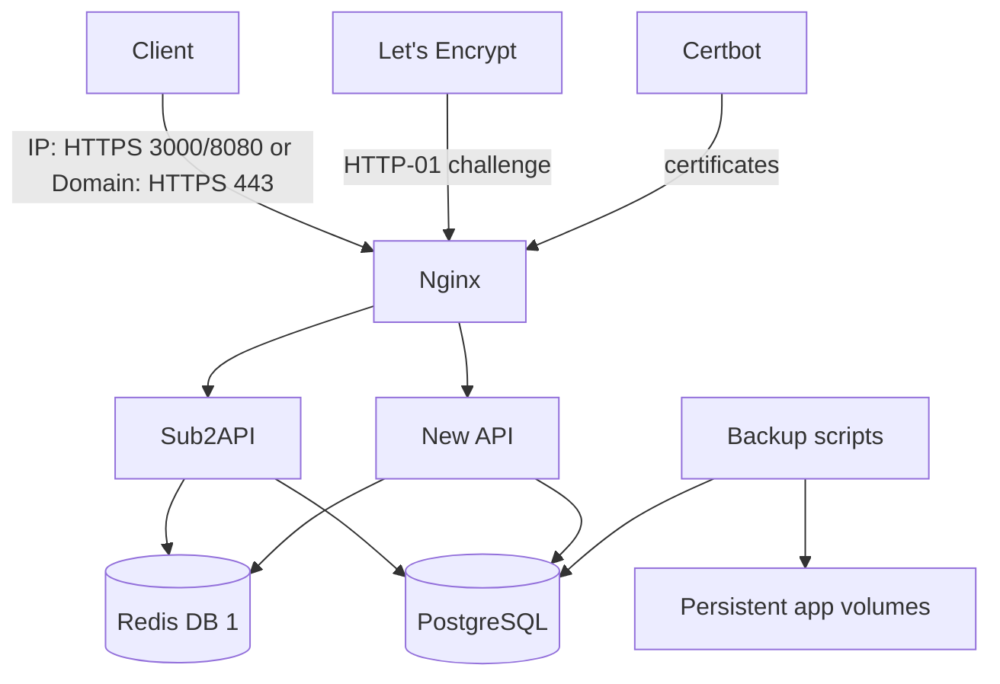

# AI API Relay Service Deployment

以 Docker Compose 在單台 4 GB RAM Hetzner VPS 部署 Sub2API、New API、Nginx、Certbot、共用 PostgreSQL 與共用 Redis。

本倉庫只管理部署與維運檔案，不修改 Sub2API 或 New API 的上游程式碼。

## 架構



| Service | Public ports | Persistent data | Health check |
|---|---:|---|---|
| Nginx | IP: 80, 3000, 8080; Domain: 80, 443 | ACME webroot, cert mounts | `/nginx-health` |
| Certbot | none | Let's Encrypt cert volume | renewal/expiry reports |
| Sub2API | none | `/app/data` | `/health` |
| New API | none | `/data`, `/app/logs` | `/api/status` |
| PostgreSQL | none | database volume | `pg_isready` |
| Redis | none | AOF volume | authenticated `redis-cli ping` |

Only Nginx publishes host ports. PostgreSQL, Redis, Sub2API, and New API stay on Docker networks.

## Quick start: IP mode

Prerequisites on the VPS:

- Ubuntu 24.04 LTS or Debian 12 on `linux/amd64`
- Docker Engine 26+ and Docker Compose v2
- 4 GB RAM, at least 20 GB disk, and recommended 2–4 GB swap
- Firewall allowing SSH from your admin IP and TCP 80 for ACME challenge
- For IP test mode, allow TCP 3000 and 8080 only from trusted friend/admin IPs when possible

```bash
cp .env.example .env
chmod 600 .env
nano .env
make init
```

`make init` generates any placeholder secrets without overwriting real values, renders config, validates Compose, starts the stack, and runs diagnostics.

Initial URLs in IP mode:

- Sub2API: `https://89.167.21.176:8080`
- New API: `https://89.167.21.176:3000`

Run TLS issuance after `.env` is complete and port 80 reaches the VPS:

```bash
make enable-tls
```

Use `LETSENCRYPT_STAGING=true` first. After staging succeeds, switch to `LETSENCRYPT_STAGING=false` and run `make enable-tls` again.

## Image tags

Sub2API and New API upstream examples commonly show `latest`. This repository intentionally rejects `latest`; set `SUB2API_IMAGE_TAG` and `NEW_API_IMAGE_TAG` to reviewed tags or immutable digests in `.env` before production deployment.

## Daily operations

```bash
make help
make up
make status
make health
make logs
make logs SERVICE=sub2api
make restart SERVICE=new-api
make stop
make start
make down
```

`make down` stops and removes containers but preserves all named volumes. Do not run `docker compose down -v` unless you intentionally want to delete PostgreSQL, Redis, app data, certificates, and ACME state.

## Backups, updates, and rollback

Create and list local backups:

```bash
make backup
make backup-list
```

Restore requires an explicit file and confirmation:

```bash
make restore FILE=backups/backup-YYYYMMDD-HHMMSS.tar.gz
```

Update by editing image tags in `.env`, then running:

```bash
make update
```

`make update` validates config, creates a backup, pulls the pinned image tags, recreates changed containers, and runs health checks. To roll back, set image tags back to a known-good version and run `make up && make health`. Database migrations may not be reversible, so keep the pre-update backup.

## Domain migration

After DNS is ready:

1. Create A records for `SUB2API_DOMAIN` and `NEW_API_DOMAIN` pointing to the VPS IPv4.
2. Do not create AAAA records unless IPv6 is correctly configured on the VPS.
3. Edit `.env`:

   ```dotenv
   DEPLOYMENT_MODE=domain
   SUB2API_DOMAIN=sub2api.your-domain.com
   NEW_API_DOMAIN=newapi.your-domain.com
   LETSENCRYPT_EMAIL=you@example.com
   LETSENCRYPT_STAGING=true
   ```

4. Run `make enable-tls` with staging.
5. Set `LETSENCRYPT_STAGING=false`, run `make enable-tls` again, then verify HTTPS.
6. Update firewall rules so public 3000/8080 are closed; domain mode publishes only 80/443.

Mode changes preserve PostgreSQL, Redis, and application volumes.

## Validation commands

```bash
./scripts/validate-env.sh
docker compose config
shellcheck scripts/*.sh postgres/init/*.sh
make health
```

Nginx config can be tested with a container after rendering:

```bash
./scripts/render-config.sh bootstrap
docker run --rm \
  -v "$PWD/config/nginx/rendered/nginx.conf:/etc/nginx/nginx.conf:ro" \
  -v "$PWD/config/nginx/rendered/conf.d:/etc/nginx/conf.d:ro" \
  -v "$PWD/config/nginx/rendered/snippets:/etc/nginx/snippets:ro" \
  nginx:1.29.1-alpine nginx -t
```

## Documentation

- [Technical PRD](PRD.md)
- [Operator guide](USER_GUIDE.md)
- [Implementation checklist](TODO.md)
- [Agent instructions](AGENTS.md)

## Security notes

- Keep `.env` mode `0600`; it contains passwords and secrets.
- Never commit `.env`, private keys, certificates, database dumps, backups, or production logs.
- Prefer Hetzner Firewall or UFW allowlists for SSH and IP-mode management ports.
- Application admin passwords and secrets should be at least 32 bytes of randomness.
- TLS certificates can be reissued and are not the most critical backup asset; database and app volumes are.

## License

MIT. See [LICENSE](LICENSE).
