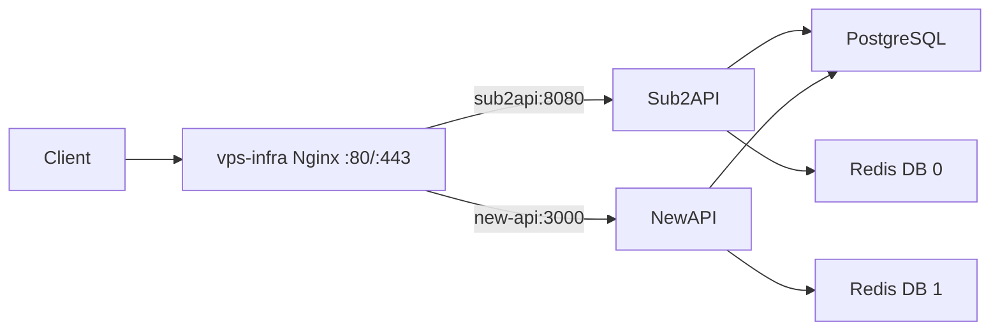

# AI API Relay deployment

Docker Compose deployment for Sub2API and New API on a 4 GB Hetzner VPS. This
repository owns the applications, PostgreSQL, Redis, their settings, and their
data. The separate `vps-infra` repository owns the shared Nginx ingress,
public ports 80/443, TLS certificates, and certificate renewal.

## Production layout

The production checkout is `/srv/stacks/ai-api-relay-deploy`. Its Compose
project name is `ai-api-relay`; its existing Docker volumes keep that prefix.
Relay owns a private `backend` network so the applications can reach PostgreSQL
and Redis. It attaches the two web applications to the external
`vps-infra_ingress` network created and managed by `vps-infra`; Compose declares
that network as external and never creates or configures it. PostgreSQL and
Redis stay on `backend` and publish no host ports.


```mermaid
flowchart LR
    Client --> InfraNginx["vps-infra Nginx :80/:443"]
    InfraNginx -->|sub2api:8080| Sub2API
    InfraNginx -->|new-api:3000| NewAPI
    Sub2API --> PostgreSQL
    NewAPI --> PostgreSQL
    Sub2API --> Redis0["Redis DB 0"]
    NewAPI --> Redis1["Redis DB 1"]
```

| Public hostname | Application | Internal port |
|---|---|---:|
| `sub2api.byte612.com` | Sub2API | 8080 |
| `api.byte612.com` | New API | 3000 |

The service names and ports are the interface consumed by infra. Ingress
network creation, routes, TLS, and route checks belong to the `vps-infra`
repository.

## First setup

Use Docker Engine with Compose v2, Git, and Make. The external network must
already exist; `vps-infra` creates and owns it.

```bash
cd /srv/stacks
git clone <repository-url> ai-api-relay-deploy
cd ai-api-relay-deploy
# sudo is needed only to create the protected directory under /etc.
sudo install -d -o "$USER" -g "$(id -gn)" -m 700 /etc/vps-infra/secrets/ai-api-relay
install -m 600 .env.example /etc/vps-infra/secrets/ai-api-relay/.env
ln -s /etc/vps-infra/secrets/ai-api-relay/.env .env
```

Set image tags and application settings in the protected `.env`. Public
hostnames and ingress routes are managed by `vps-infra`. Replace all
`change-me` values, then initialize:

```bash
make init
make health
```

`make init` creates missing application secrets without replacing existing
values, validates the settings, and starts the four Compose services. It does
not issue or renew TLS certificates; `vps-infra` owns that lifecycle.

## Image versions

Every image has an explicit tag in `compose.yaml`, with the selected tag
recorded in `.env`. Sub2API, PostgreSQL, and Redis use fixed release tags. New
API's latest upstream release is `v1.0.0-rc.40` (an RC); the last formal stable
tag is `v0.13.2`, released on 2026-04-27. This deployment is already on RC.40,
so keep it pinned until v1.0 GA or a tested compatibility and restore plan is
available. See the [upstream release list](https://github.com/QuantumNous/new-api/releases)
and [v0.13.2 release](https://github.com/QuantumNous/new-api/releases/tag/v0.13.2).

## Common operations

```bash
make status
make health
make logs SERVICE=sub2api
make logs SERVICE=new-api
make backup
make backup-list
make update
make down
```

`make down` removes the app containers and keeps all named data volumes.
Never use `docker compose down -v` for routine maintenance. It deletes the
databases, Redis data, and application data.

Before an image update, `make update` creates a database and volume backup,
pulls the tags in `.env`, recreates changed services, and runs health checks.
Restore the previous tags to roll back an image. If an application migration
has changed the database schema, restore the matching pre-update backup before
starting the older image.

Backups go to `BACKUP_DIR`, defaulting to `/home/alex/backups/ai-api-relay`.
The archive includes both PostgreSQL databases, Redis data, and application
volumes, with a SHA-256 checksum. Restore is destructive to current app data;
the script checks the checksum and asks for confirmation.

## Troubleshooting

```bash
docker compose config --quiet
docker compose ps
docker compose logs --tail=100 sub2api new-api postgres redis
docker compose exec postgres pg_isready -U "$POSTGRES_USER" -d "$POSTGRES_DB"
docker compose exec redis redis-cli --no-auth-warning ping
```

`make health` checks Relay container health and the two application endpoints.
The `vps-infra` repository owns ingress and TLS checks.

## Documentation

- [Operator guide](USER_GUIDE.md)
- [Project requirements](PRD.md)
- [Current deployment evidence](docs/current-state.md)
- [Work checklist](TODO.md)
