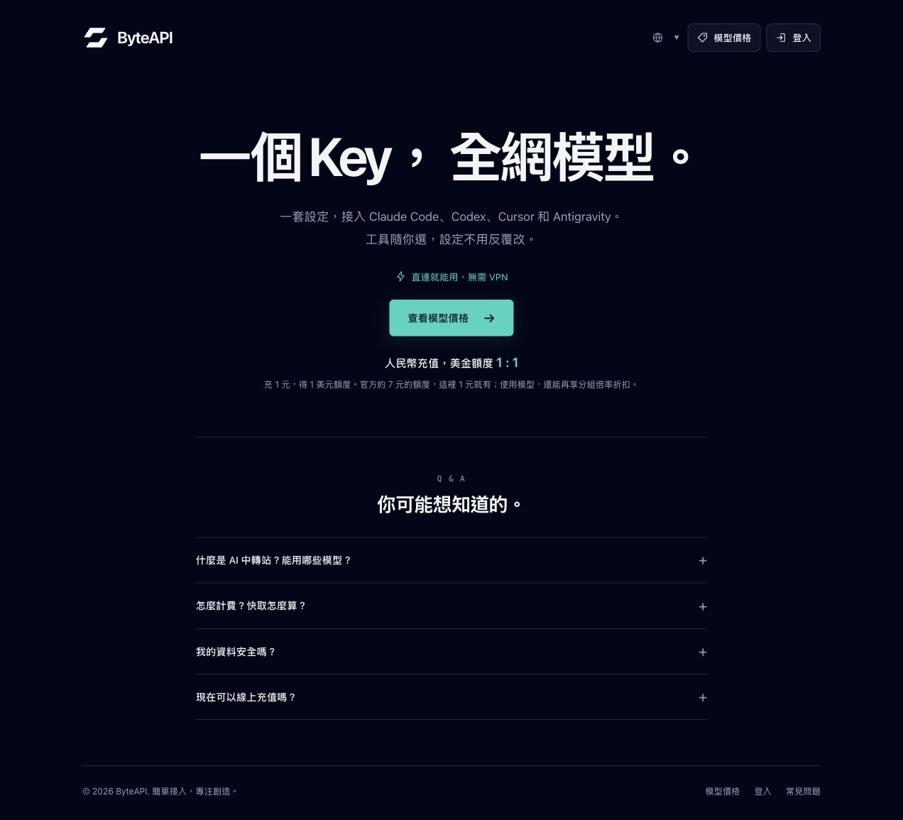
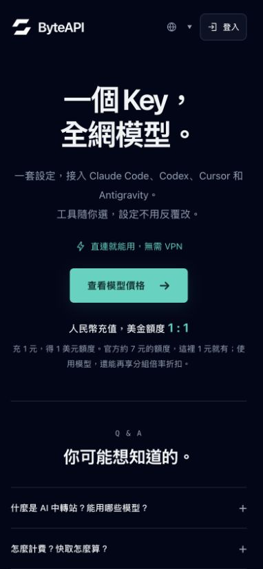

# ByteAPI 自有首頁

**正式網址：** <https://sub2api.byte612.com/home>。
**開發分支：** `codex/brand-homepage`。
**部署時間：** 2026-10-10 02:34–02:37 Asia/Hong_Kong。

首頁來源為
[`centered-sub2api-v3.html`](../config/sub2api/homepage/centered-sub2api-v3.html)。
這是可貼入 Sub2API Home Page Content 的完整 HTML fragment，沒有 script、
外部字型、追蹤工具或前端套件依賴。

## 設計與入口

- 固定深色，白色標誌與 ByteAPI 字標，居中極簡首屏。
- 地球圖示及小箭頭開啟語言選單，提供簡體中文、繁體中文和英文。
- 登入使用原本的深色按鈕；模型價格 CTA 使用青綠實心底。
- 手機頁首為單行：ByteAPI 左側、語言與登入右側。手機不顯示頁首重複的
  模型價格按鈕，保留主內容 CTA 和頁尾入口。
- 移除主題切換、20% 價格區塊、三步接入教學、首屏控制台 CTA，以及
  「AI 中轉站 / BYTEAPI」小標。
- 保留四題原生 Q&A、指定工具接入文案、無需 VPN 與充值額度 1:1 說明。
  支付寶在線充值仍明示準備中。

| 入口 | href | 行為 |
|---|---|---|
| 品牌 | `/home` | 首頁 |
| 登入 | `/login` | 登入頁；已登入帳戶由 Sub2API 導向 `/dashboard` |
| 模型價格 | `/model-plaza` | 模型廣場 |
| 常見問題 | `#byte-faq` | 同頁 Q&A 區塊 |

所有應用入口使用同站相對路徑，沒有混用 New API 網域。

## 套用方式

一般更新可由 Sub2API 管理設定的 Home Page Content 欄位貼入完整 fragment。
不要貼入本機設計比較頁 `index.html`。樣式限定在 `#byte-home`，SVG 已內嵌。

本次使用普通帳戶檢查畫面，沒有管理設定頁權限；VPS 部署透過 PostgreSQL
更新單一 `settings.key = 'home_content'`，流程如下：

1. 核對 Compose config、現有 service、named volumes 及原首頁 SHA-256。
2. 將原 `home_content` row、回退 SQL 和部署 metadata 存到 repo 之外的
   保護備份目錄；目錄 `0700`、檔案 `0600`。
3. Transaction 鎖定原 row，再核對原內容未改變，才更新首頁。
4. 比較儲存內容與來源，並確認其他 settings 的聚合雜湊前後一致。
5. 使用 `make restart SERVICE=sub2api` 刷新無 TTL 的 HTML cache。
6. 核對公開頁內容、服務健康、連結與手機版面。

本次沒有 pull image、重建容器、資料庫 migration、修改 secrets、Compose、
支付設定或 infra。既有 image `0.2.9`／runtime `0.2.11` 漂移仍需按既有維運
紀錄處理，首頁更新只重啟原容器。

### 部署識別與回退準備

- VPS 來源：
  `/srv/stacks/ai-api-relay-deploy/config/sub2api/homepage/centered-sub2api-v3.html`。
- SHA-256：
  `3c07c94fa463a2ac824db93e730f2b46744882ef989cde36969de70298f6967e`。
- 原首頁 SHA-256：
  `58514420ff87e5d1027c6b909643c467f7de0de19585cd6e22607370fa2c10d2`。
- 備份：`/home/alex/backups/ai-api-relay/homepage-20261009-183450/`。
  含 `home_content-before.json`、`rollback.sql`、`deployment.json`。

備份未加入 Git，也未執行回退。需要回退時先依 `AGENTS.md` 取得還原確認，
套用對應單一設定回退 SQL，再重啟 Sub2API 並核對公開內容。

## 驗證結果

- 部署前 `git fetch origin`，分支與 `origin/main` 提交差距為 `0 / 0`。
- `docker compose config --quiet` 通過。
- Docker inspect 選定欄位確認四容器 healthy、host PortBindings 為空；
  只有兩個 web apps 接 ingress，PostgreSQL／Redis 只接 private backend。
- `docker compose exec -T sub2api wget -qO- http://127.0.0.1:8080/health`
  回 `status=ok`。
- 無 cookie 的公開 HTTPS 回應為 200，注入的 `home_content` 與本機來源
  逐字一致，SHA-256 相同。
- 正式瀏覽器確認三語切換、固定深色、模型價格 CTA、登入導向及 FAQ。
  根網址 `/` 進入 `/home`，登入 href 為 `/login`；現有已登入帳戶正常
  導向 `/dashboard`。FAQ 錨點留在首頁，付款答案可展開。
- 正式 390px 繁中、320px 英文：語言及登入 y 均為 20px、高度均為 40px，
  維持同一行。捲軸佔 8px，clientWidth／scrollWidth 分別相同為 382／312，
  沒有水平溢出。完成後還原 viewport。

## 截圖

## 目前限制

語言不持久化，重載預設簡體中文，未與控制台語言同步。Customizable select
適用目前 Codex 瀏覽器；不支援 `appearance:base-select` 的瀏覽器使用原生
文字選單。未實測 Safari／Firefox 或所有手機瀏覽器。

部署前已開啟的 app 分頁或瀏覽器歷史可能保留舊首頁，重新整理可載入新版。
匿名 HTTPS 內容已確認；匿名註冊端到端、實際計費換算、各工具相容性與
資料留存行為未在此次首頁部署中驗證。產品文案依使用者指定，支付功能尚未實作。
